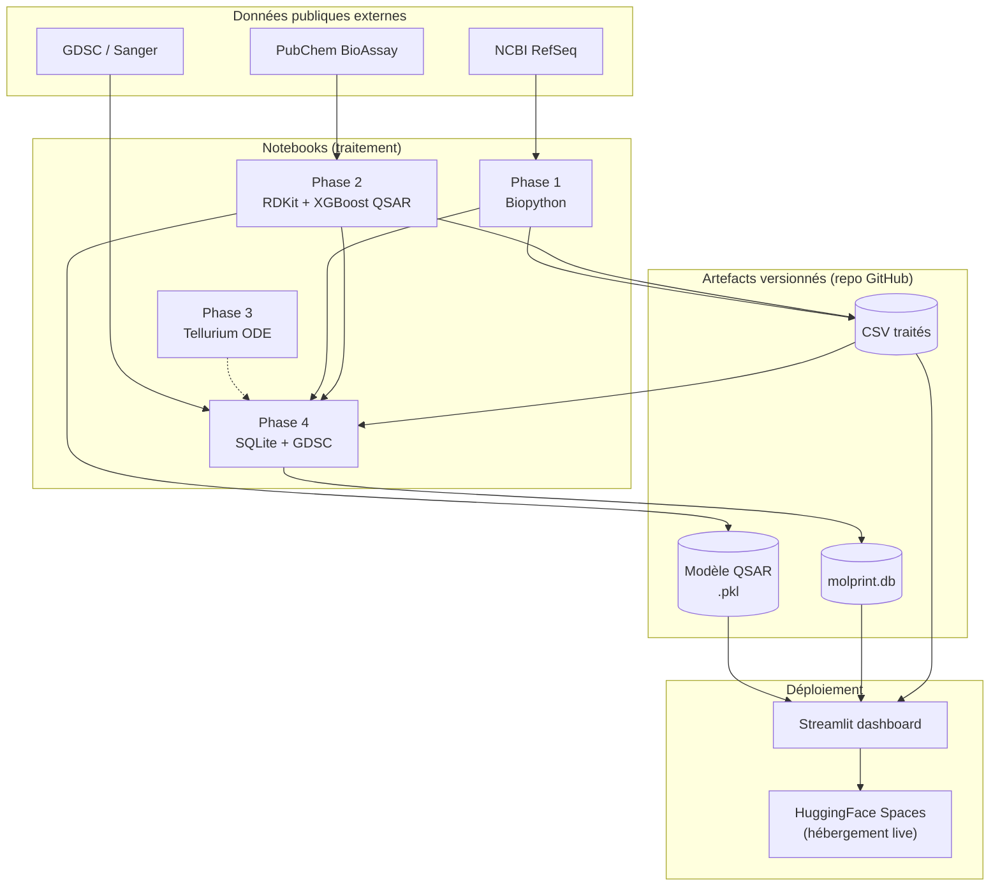

# MolPrint — Le guide complet, pour comprendre vraiment

Ce document explique **tout** le projet MolPrint, du premier notebook au dashboard en ligne, comme si tu n'y connaissais rien. Chaque notion technique (Python, SQL, machine learning, chimie, biologie) est expliquée avant d'être utilisée, avec une analogie du quotidien. Les vrais chiffres obtenus sont donnés partout — pas d'approximation vague.

À la fin, tu trouveras un audit technique complet (architecture, sécurité, data leakage/overfitting) et une feuille de route d'évolutions possibles.

---

## Table des matières

1. [Le projet en 2 minutes](#1-le-projet-en-2-minutes)
2. [Les briques de base expliquées simplement](#2-les-briques-de-base-expliquées-simplement)
3. [Phase 1 — Biopython : lire l'ADN comme un livre](#3-phase-1--biopython--lire-ladn-comme-un-livre)
4. [Phase 2 — Chémoinformatique : prédire si une molécule est un médicament](#4-phase-2--chémoinformatique--prédire-si-une-molécule-est-un-médicament)
5. [Le Machine Learning en détail — et pourquoi XGBoost](#5-le-machine-learning-en-détail--et-pourquoi-xgboost)
6. [Data leakage et overfitting — expliqués avec NOTRE bug réel](#6-data-leakage-et-overfitting--expliqués-avec-notre-bug-réel)
7. [Phase 3 — Biologie des systèmes : la voie de signalisation comme un circuit de plomberie](#7-phase-3--biologie-des-systèmes--la-voie-de-signalisation-comme-un-circuit-de-plomberie)
8. [Phase 4 — SQL pour les nuls, par étapes](#8-phase-4--sql-pour-les-nuls-par-étapes)
9. [Phase 5 — Du notebook au site web : comment ça se déploie](#9-phase-5--du-notebook-au-site-web--comment-ça-se-déploie)
10. [Audit technique et architecture](#10-audit-technique-et-architecture)
11. [Data leakage / overfitting : le verdict complet](#11-data-leakage--overfitting--le-verdict-complet)
12. [Axes d'amélioration et évolutions possibles](#12-axes-damélioration-et-évolutions-possibles)
13. [Pourquoi ce projet a de la valeur (honnêtement)](#13-pourquoi-ce-projet-a-de-la-valeur-honnêtement)

---

## 1. Le projet en 2 minutes

**Le problème** : dans le cancer du sein, toutes les tumeurs ne se ressemblent pas. On les classe en **sous-types moléculaires** (Luminal A, Luminal B/HER2+, HER2-enrichi, Triple Négatif) parce que chaque sous-type répond différemment aux traitements. [OncoPrint](https://github.com/marinedde/cdsd-certification/tree/main/bloc6-direction-projet/oncoprint) (ton projet de certification) résout la première moitié du problème : à partir du profil génomique d'une patiente, il prédit son sous-type.

**MolPrint résout la suite** : une fois qu'on connaît le sous-type, *quel médicament essayer, et pourquoi ?* Pour y répondre, le projet construit 5 briques, chacune correspondant à une compétence réelle du métier de Data Scientist en R&D pharmaceutique préclinique :

| Brique | Question à laquelle elle répond | Analogie |
| --- | --- | --- |
| **Phase 1 — Biopython** | À quoi ressemble le gène/la protéine derrière un sous-type ? | Lire la recette de cuisine (le gène) au lieu de juste regarder la photo du plat |
| **Phase 2 — Chémoinformatique** | Une molécule donnée va-t-elle marcher sur cette cible ? | Essayer virtuellement une clé dans une serrure, sans fabriquer la clé |
| **Phase 3 — Biologie des systèmes** | Que se passe-t-il *dans la cellule* quand on bloque la cible ? | Simuler un circuit de plomberie avant de couper une vanne réelle |
| **Phase 4 — Base de données** | Comment relier tout ça, et est-ce cohérent avec la réalité du labo ? | Un dossier patient unique au lieu de classeurs séparés |
| **Phase 5 — Dashboard** | Comment le montrer à quelqu'un qui ne code pas ? | Transformer un carnet de notes en site web cliquable |

Chaque brique s'appuie sur des **données publiques réelles** (PubChem, NCBI, GDSC — pas de données inventées), et chaque résultat a été **vérifié en le faisant tourner** (pas juste écrit et espéré).

---

## 2. Les briques de base expliquées simplement

Avant d'entrer dans le projet, quelques notions qui reviennent partout.

### Python

Python est un langage de programmation — une façon d'écrire des instructions qu'un ordinateur exécute dans l'ordre, de haut en bas. Une analogie : c'est une recette de cuisine très précise, où chaque ligne est une étape ("prends 2 œufs", "bats-les"), sauf qu'ici les "ingrédients" sont des nombres, du texte, ou des tableaux de données.

Deux briques Python reviennent partout dans ce projet :
- **pandas** : une bibliothèque pour manipuler des tableaux (comme Excel, mais en code — un `DataFrame` est un tableau avec des lignes et des colonnes nommées).
- **une fonction** : un bout de recette réutilisable. `def compute_descriptors(smiles):` veut dire "voici une recette qui prend un SMILES en entrée et qui rend un résultat" — on peut l'appeler autant de fois qu'on veut sans réécrire le code.

### Un notebook Jupyter (`.ipynb`)

Un notebook, c'est un cahier où le code et ses résultats (texte, tableaux, graphiques) s'affichent juste en dessous de chaque bloc de code, dans l'ordre où on les exécute. C'est l'outil de travail standard en data science parce qu'on peut explorer pas à pas et voir immédiatement si un bout de code fonctionne, sans attendre que tout le programme tourne.

### Qu'est-ce qu'un modèle de Machine Learning ?

Un modèle ML, c'est une fonction mathématique qu'on n'écrit **pas** à la main — on la fait apprendre à partir d'exemples. Analogie : au lieu d'écrire toi-même la règle "si la molécule a telle forme, elle est probablement active", tu montres au modèle 1000 molécules dont tu connais déjà la réponse (active/inactive), et il *devine* la règle tout seul, statistiquement. Une fois entraîné, il peut appliquer cette règle apprise à une molécule qu'il n'a jamais vue.

### Git / GitHub

Git garde un historique de toutes les versions d'un projet (comme un "suivi des modifications" géant). GitHub est le site qui héberge ce projet en ligne, public, pour que n'importe qui (toi dans 6 mois, un recruteur, un collègue) puisse voir tout l'historique et récupérer le code.

### SQL et une base de données

Une base de données, c'est un ensemble de tableaux liés entre eux (comme plusieurs feuilles Excel qui se référencent). SQL est le langage pour interroger ces tableaux ("donne-moi toutes les lignes où..."). Le détail complet est dans la [section 8](#8-phase-4--sql-pour-les-nuls-par-étapes).

### Déploiement / dashboard

"Déployer" veut dire faire tourner ton code en continu sur un serveur accessible par internet, avec une interface visuelle (boutons, tableaux, graphiques) au lieu d'un notebook que toi seule sais lancer. Détail en [section 9](#9-phase-5--du-notebook-au-site-web--comment-ça-se-déploie).

---

## 3. Phase 1 — Biopython : lire l'ADN comme un livre

**Fichier** : [`notebooks/05_gene_sequence_analysis.ipynb`](../notebooks/05_gene_sequence_analysis.ipynb), fonctions dans [`src/sequence_analysis.py`](../src/sequence_analysis.py)

### L'idée

OncoPrint traite les gènes comme des **colonnes d'un tableau** (une valeur numérique par gène, par patiente). Cette phase va plus loin : elle va lire la séquence *réelle* de ces gènes — les lettres A, T, C, G qui les composent — comme on lirait le texte d'un livre plutôt que juste son résumé en 4ème de couverture.

**Analogie ADN/ARN/protéine** : l'ADN est le livre de recettes original, gardé précieusement (dans le noyau de la cellule). L'ARN est une photocopie de travail qu'on sort en cuisine. La protéine, c'est le plat une fois cuisiné à partir de la recette — c'est elle qui fait le travail concret dans la cellule.

### Quels gènes, et pourquoi ceux-là

Plutôt que de choisir des gènes au hasard, ce projet reprend les **5 gènes qui pesaient le plus dans les prédictions SHAP d'OncoPrint** (un par sous-type de cancer) :

| Gène | Sous-type où il domine | Rôle biologique |
| --- | --- | --- |
| ESR1 | Luminal A | Récepteur aux œstrogènes — cible de l'hormonothérapie |
| ERBB2 (HER2) | HER2-enrichi | Récepteur de croissance — cible du trastuzumab |
| FOXA1 | Triple Négatif | Facteur de transcription "pionnier" |
| AR | Triple Négatif | Récepteur aux androgènes — piste thérapeutique émergente |
| GATA3 | Luminal A | Facteur de différenciation cellulaire |

**Pourquoi c'est important méthodologiquement** : ça ancre cette phase sur des résultats déjà produits (SHAP, une vraie mesure d'importance), plutôt que de choisir arbitrairement "les gènes connus du cancer du sein".

### Le code, étape par étape

**1. Récupérer la séquence depuis NCBI.** NCBI (National Center for Biotechnology Information, USA) est la plus grande base de données publique de séquences génétiques au monde. Biopython (`Bio.Entrez`) sait l'interroger directement en Python :

```python
def fetch_canonical_mrna_accession(gene_symbol, organism="Homo sapiens"):
    term = f"{gene_symbol}[Gene Name] AND {organism}[Organism] AND biomol_mrna[PROP] AND RefSeq[Filter]"
    ids = Entrez.read(Entrez.esearch(db="nucleotide", term=term, retmax=50))["IdList"]
    ...
    return nm_hits[0]  # le premier accession "NM_..." (séquence curée par des experts)
```

Analogie : c'est comme chercher un livre précis dans le catalogue d'une immense bibliothèque en donnant son titre exact, plutôt que de deviner sa cote au hasard.

**2. Traduire l'ADN en protéine.** Une fois la séquence récupérée, Biopython sait appliquer le "code génétique" (la table qui dit que le triplet de lettres "ATG" = démarrage, "TAA" = stop, etc.) :

```python
protein_seq = str(cds_seq.translate(to_stop=True))
```

On a vérifié que cette traduction "maison" donne *exactement* la même protéine que celle déjà annotée par les experts de NCBI — une bonne façon de valider qu'on n'a pas fait d'erreur.

**3. Calculer des propriétés physico-chimiques de la protéine** (poids moléculaire, point isoélectrique, "indice d'instabilité" — une estimation de la stabilité de la protéine) via `Bio.SeqUtils.ProtParam`.

### Résultats obtenus

| Gène | GC% ARNm | Longueur protéine | PM protéine (kDa) |
| --- | --- | --- | --- |
| ESR1 | 46,64% | 595 aa | 66,22 |
| ERBB2 | 58,23% | **1225 aa** | **134,85** |
| FOXA1 | 50,44% | 472 aa | 49,15 |
| AR | 48,06% | 920 aa | 99,19 |
| GATA3 | 53,71% | 444 aa | 48,04 |

ERBB2/HER2 ressort comme, de loin, la plus grosse protéine du lot (134,85 kDa) — cohérent avec la biologie connue : HER2 est un gros récepteur transmembranaire à activité tyrosine kinase, pas un petit facteur de transcription comme GATA3 ou FOXA1.

### Le résultat le plus marquant : la mutation Y537S

**Le fait clinique** : dans le cancer du sein métastatique, une des mutations de résistance à l'hormonothérapie les mieux documentées s'appelle **Y537S** — elle transforme la tyrosine (Y) en position 537 de la protéine ESR1 en sérine (S), ce qui active le récepteur *même sans hormone*.

**Ce qu'on a fait** : sans base de données de mutations, juste en regardant la séquence traduite :

```python
position = 537
residue = esr1_protein[position - 1]  # -1 car les listes commencent à 0 en Python
print(residue)  # -> 'Y'
```

Résultat : **la position 537 est bien une tyrosine**. On a ensuite simulé la mutation (remplacer artificiellement Y par S dans la séquence) et recalculé les propriétés physico-chimiques avant/après — un petit exercice qui illustre le principe, même si une vraie évaluation d'impact fonctionnel demanderait une structure 3D de la protéine (hors scope ici).

---

## 4. Phase 2 — Chémoinformatique : prédire si une molécule est un médicament

C'est la phase la plus riche du projet, répartie sur 4 notebooks. Cible thérapeutique choisie : **HER2/ERBB2**, parce qu'elle relie directement au sous-type "HER2-enrichi" et à un médicament réel bien connu (trastuzumab/Herceptin).

### Notebook 01 — Récupérer des données réelles d'activité biologique

**Fichier** : [`notebooks/01_bioactivity_data_acquisition.ipynb`](../notebooks/01_bioactivity_data_acquisition.ipynb)

**L'idée** : pour entraîner un modèle qui prédit "cette molécule est-elle active sur HER2 ?", il faut d'abord un jeu de données de molécules dont on connaît déjà la réponse (mesurée en laboratoire).

**Où trouver ça** : ChEMBL (base pharmacologique européenne) était visée au départ, mais son API était en panne (erreurs 500) au moment de l'écriture — vérifié en direct avec `curl`, pas supposé. On a basculé sur **PubChem BioAssay** (NIH, USA), qui expose une table "bioactivity concise" : pour un gène cible donné, tous les résultats de tests biologiques publics sur ce gène.

**Le code clé** :
```python
resp = requests.get(f"{PUG_REST}/gene/geneid/{gene_id}/concise/JSON", timeout=60)
```
Ça récupère un gros tableau où chaque ligne = une molécule testée dans un essai donné, avec le résultat (Active/Inactive) et parfois une valeur chiffrée (l'IC50 — la concentration nécessaire pour bloquer la moitié de l'activité de la cible ; plus l'IC50 est bas, plus la molécule est puissante).

**Nettoyage** : une même molécule peut apparaître dans plusieurs essais différents. On agrège par molécule (`groupby`) en gardant le résultat majoritaire et la meilleure valeur observée.

**Résultat** : **1070 molécules uniques**, à peu près équilibrées (546 actives / 524 inactives) — un jeu de données sain, sans déséquilibre extrême qui biaiserait le modèle.

### Notebook 02 — Premier modèle : les descripteurs moléculaires

**Fichier** : [`notebooks/02_rdkit_descriptors_qsar.ipynb`](../notebooks/02_rdkit_descriptors_qsar.ipynb)

**Qu'est-ce qu'un "descripteur moléculaire"** : un nombre qui résume une propriété globale d'une molécule — son poids, sa solubilité (LogP), le nombre de donneurs/accepteurs de liaison hydrogène, etc. RDKit (la bibliothèque de référence en chémoinformatique open-source) les calcule directement à partir du **SMILES** — une façon d'écrire une molécule en texte, comme un code postal chimique (ex. `CC(=O)OC1=CC=CC=C1C(=O)O` = aspirine).

**Les règles de Lipinski** ("règle des 5") : une heuristique de 1997 qui dit qu'une molécule a plus de chances d'être un médicament oral utilisable si son poids < 500, son LogP < 5, etc. On les calcule aussi, comme indicateur (pas un filtre strict).

**Un vrai bug trouvé et corrigé pendant ce notebook** : la première version faisait un `dropna()` sur *toutes* les colonnes, y compris `pactivity` (la valeur IC50 chiffrée) — qui n'existe que pour les essais quantitatifs, pas les essais qualitatifs (juste "actif"/"inactif"). Ça éliminait silencieusement une grande partie des molécules inactives, rendant le jeu d'entraînement déséquilibré à ~95% actif. **Corrigé** en ne faisant `dropna()` que sur les colonnes de descripteurs (celles dont le modèle a réellement besoin) :
```python
data = pd.concat([df, descriptors_df], axis=1).dropna(subset=list(descriptors_df.columns))
```
Résultat après correction : 1070 molécules conservées, jeu de test équilibré, **ROC AUC ≈ 0,976** (voir [section 5](#5-le-machine-learning-en-détail--et-pourquoi-xgboost) pour ce qu'est le ROC AUC).

### Notebook 03 — Criblage virtuel : générer de nouveaux candidats

**Fichier** : [`notebooks/03_virtual_screening_optimization.ipynb`](../notebooks/03_virtual_screening_optimization.ipynb)

Jusqu'ici, le modèle ne fait que *noter* une molécule qu'on lui donne. Cette phase va plus loin : elle **génère** de nouvelles molécules candidates.

**Étape 1 — Benchmark de cohérence.** Avant de générer quoi que ce soit, on vérifie que le modèle a du bon sens : on lui donne 5 vrais médicaments anti-HER2 approuvés (lapatinib, neratinib, tucatinib, afatinib, pyrotinib — SMILES récupérés directement depuis PubChem, pas tapés à la main) et on regarde s'il leur donne un score élevé. **Résultat (modèle final) : tucatinib 0,99, afatinib 0,99, lapatinib 0,98, pyrotinib 0,89, neratinib 0,88** — tous nettement au-dessus de 0,5, un bon signal.

**Étape 2 — Génération par BRICS.** BRICS (*Breaking Retrosynthetically Interesting Chemical Substructures*) est un algorithme qui découpe une molécule en fragments "chimiquement sensés" (aux bons endroits, pas n'importe où), puis peut les recombiner pour créer de nouvelles molécules. Analogie : au lieu de dessiner une nouvelle voiture depuis zéro, on prend les pièces (moteur, châssis, roues) de plusieurs voitures qui marchent bien, et on les réassemble différemment.

```python
fragments = set()
for smi in top_actives["canonical_smiles"]:  # les 15 molécules les plus actives connues
    fragments.update(BRICS.BRICSDecompose(Chem.MolFromSmiles(smi)))
builder = BRICS.BRICSBuild(fragment_mols)  # recombine les fragments
```
Résultat : **3000 nouvelles molécules générées** (jamais vues dans le jeu d'entraînement).

**Étape 3 — Filtre de diversité.** Un problème classique de BRICS : il génère beaucoup de quasi-doublons (même squelette, connexions légèrement différentes). Après un filtre sur les règles de Lipinski (≤1 violation), il reste 2343 candidats ; on les regroupe par proximité structurelle (clustering **Butina** sur des empreintes de Morgan — voir section 5) et on ne garde que le meilleur de chaque groupe : **2343 candidats → 172 groupes structurels distincts**, top 15 sélectionné sur le meilleur représentant de chaque groupe.

### Notebook 04 — Deuxième modèle : les empreintes moléculaires

**Fichier** : [`notebooks/04_fingerprint_qsar.ipynb`](../notebooks/04_fingerprint_qsar.ipynb)

**Le problème avec les descripteurs seuls** : 10 nombres globaux (poids, LogP...) c'est un peu comme décrire une personne uniquement par sa taille et son poids — ça perd toute la "forme" en détail. Deux molécules avec le même poids moléculaire peuvent avoir des structures chimiques complètement différentes.

**La solution : les empreintes de Morgan (ECFP)**, le standard du domaine. Le principe : pour chaque atome de la molécule, on regarde son voisinage proche (rayon 2 = 2 liaisons autour), on encode ce "quartier" en un nombre, et on active un bit (0→1) dans un vecteur de 1024 cases. Deux molécules qui partagent les mêmes sous-structures locales auront des bits communs. C'est littéralement une empreinte digitale chimique.

**Comparaison rigoureuse (validation croisée à 5 plis, voir section 5)** :

| Représentation | ROC AUC (moyenne ± écart-type) |
| --- | --- |
| Descripteurs seuls | 0,9545 ± 0,0151 |
| Empreintes de Morgan seules | 0,9747 ± 0,0083 |
| **Combiné (les deux)** | **0,9803 ± 0,0073** |

Le modèle combiné gagne, et devient le **modèle final** utilisé partout en aval (dashboard, base de données). Sur le jeu de test isolé, il obtient un ROC AUC de 0,9812.

---

## 5. Le Machine Learning en détail — et pourquoi XGBoost

### C'est quoi, concrètement, entraîner un modèle ?

Analogie : imagine que tu veuilles apprendre à un enfant à reconnaître si un fruit est mûr, juste en le regardant. Tu ne lui donnes pas une formule mathématique — tu lui montres 1000 fruits en lui disant "celui-ci est mûr, celui-là non", et il finit par repérer tout seul les indices (couleur, taille...). Un modèle ML fait pareil, mais avec des nombres : on lui montre 1070 molécules (leurs descripteurs/empreintes) avec l'étiquette "active" ou "inactive", et il ajuste ses paramètres internes pour minimiser ses erreurs sur ces exemples.

### Qu'est-ce qu'un arbre de décision, et pourquoi XGBoost

Un **arbre de décision** pose une suite de questions simples ("le poids moléculaire est-il > 400 ?", puis "le LogP est-il > 3 ?"...) pour arriver à une prédiction — comme un arbre "qui est-ce ?". Un seul arbre est souvent trop simpliste (il généralise mal). **XGBoost** (*eXtreme Gradient Boosting*) construit une **série** de petits arbres, chacun corrigeant les erreurs du précédent, et additionne leurs votes. C'est la méthode de référence pour les données "tabulaires" (des tableaux de nombres, comme nos descripteurs/empreintes) — elle domine encore aujourd'hui ce type de problème face aux réseaux de neurones, qui ont besoin de beaucoup plus de données pour être compétitifs.

### Pourquoi XGBoost plutôt qu'un autre modèle, concrètement pour ce projet

| Alternative | Pourquoi pas elle (ici) |
| --- | --- |
| **Régression logistique** | Simple et interprétable, mais ne capture pas bien les interactions complexes entre descripteurs sans les construire à la main |
| **Random Forest** | Très proche d'XGBoost (aussi une forêt d'arbres), mais construit ses arbres indépendamment (en parallèle) plutôt que de corriger les erreurs séquentiellement — XGBoost obtient généralement une meilleure performance sur des jeux de taille moyenne comme le nôtre |
| **SVM / k-NN** | Sensibles à l'échelle des variables (il faudrait normaliser poids moléculaire et bits d'empreinte 0/1 sur la même échelle) — les arbres n'ont pas ce problème |
| **Réseau de neurones profond / Graph Neural Network** | L'état de l'art moderne en QSAR à grande échelle (10 000+ molécules), mais avec seulement ~1000 molécules, un réseau profond apprendrait surtout du bruit (overfitting) — piste d'évolution si le jeu de données grandit (voir section 12) |

**Réglages choisis** (`n_estimators=200, max_depth=4, learning_rate=0.05`) : volontairement modestes — arbres peu profonds (max_depth=4, donc 4 questions maximum par arbre), beaucoup de petits arbres plutôt que peu de gros (`learning_rate` bas = chaque arbre corrige un tout petit peu), un choix classique pour limiter l'overfitting sur un jeu de données de taille moyenne. Ce ne sont pas des valeurs "optimisées" par une recherche exhaustive (grid search) — un axe d'amélioration listé en section 12.

### La validation croisée (cross-validation), expliquée simplement

Si on entraîne le modèle sur 80% des données et qu'on le teste sur les 20% restants, le résultat dépend un peu du hasard de ce découpage précis. La **validation croisée à 5 plis** répète l'opération 5 fois, avec un découpage différent à chaque fois (chaque portion sert une fois de test), puis on moyenne les 5 scores. Ça donne un résultat plus fiable, avec une mesure de sa stabilité (l'écart-type). Analogie : plutôt que de juger un élève sur un seul contrôle, on fait la moyenne de 5 contrôles différents.

### ROC AUC, précision, rappel : que veulent dire ces chiffres

- **ROC AUC** (*Area Under the Curve*) : un score entre 0,5 (le modèle devine au hasard) et 1 (parfait), qui mesure la capacité du modèle à bien classer une molécule active *au-dessus* d'une molécule inactive, quel que soit le seuil de décision choisi. Un score de 0,98 est excellent (mais voir section 6 pour la nuance importante).
- **Précision** : parmi les molécules que le modèle dit "actives", combien le sont vraiment ?
- **Rappel** : parmi les molécules réellement actives, combien le modèle en a-t-il trouvé ?

Il y a souvent un compromis entre les deux (être plus prudent améliore la précision mais baisse le rappel, et inversement) — c'est pour ça qu'on regarde toujours les deux ensemble, pas juste l'AUC seule.

---

## 6. Data leakage et overfitting — expliqués avec NOTRE bug réel

Ce sont les deux pièges les plus fréquents en Machine Learning, et ce projet en a rencontré un exemple concret et mesurable — la meilleure façon de comprendre, c'est avec du vrai.

### Overfitting : le modèle "apprend par cœur" au lieu de comprendre

Analogie : un élève qui apprend par cœur les réponses exactes des exercices du livre, sans comprendre la méthode, aura 20/20 sur ces exercices précis mais s'effondrera à l'examen avec des questions légèrement différentes. Un modèle qui "overfit" fait pareil : excellent sur les données d'entraînement, mauvais sur des données nouvelles.

### Data leakage : l'info du futur qui fuite dans le passé

Le data leakage, c'est quand une information qui ne devrait pas être disponible au moment de la prédiction se retrouve, d'une façon ou d'une autre, dans les données d'entraînement — donnant un score trompeusement bon.

### Le cas concret de MolPrint : le split aléatoire trop optimiste

Le jeu de données contient beaucoup de **molécules chimiquement très proches** (des variantes d'une même famille testées ensemble en laboratoire). Un découpage train/test **aléatoire** (comme fait dans les notebooks 02 et 04) peut placer deux quasi-jumelles chimiques de part et d'autre du split : le modèle "a déjà vu" une molécule presque identique à celle du test, sans jamais avoir vu *exactement* cette ligne — techniquement pas un bug, mais le score obtenu est optimiste par rapport à ce que le modèle saura vraiment faire sur de la chimie *neuve*.

**On l'a mesuré, pas supposé** ([`notebooks/06_scaffold_validation_applicability_domain.ipynb`](../notebooks/06_scaffold_validation_applicability_domain.ipynb)) :

1. **1070 molécules, mais seulement 499 squelettes chimiques uniques** (calculés avec la méthode de Bemis-Murcko, qui réduit une molécule à son "ossature" — enlève les petites décorations chimiques en périphérie pour ne garder que la charpente). Un squelette a même 66 molécules qui en dérivent.
2. On a comparé un split **aléatoire** classique à un split **par squelette** (`GroupKFold` de scikit-learn — regroupe *toutes* les molécules d'un même squelette du même côté du split, jamais réparties) :

| Méthode | ROC AUC |
| --- | --- |
| Split aléatoire (5-fold) | 0,9803 |
| **Split par squelette** (5-fold) | **0,9723** |
| Hold-out aléatoire (un seul split 80/20) | 0,9812 |
| **Hold-out par squelette** (un seul split 80/20, squelettes jamais vus en train) | **0,9119** |

Sur un hold-out unique, l'écart est spectaculaire : **0,98 → 0,91**, et surtout le **rappel sur la classe active tombe à 0,59** — sur une chimie vraiment inédite, le modèle en rate 4 sur 10.

**Ce n'est PAS un bug de leakage classique** (aucune étiquette du test n'a jamais été visible par le modèle pendant l'entraînement) — c'est un phénomène connu et documenté du domaine QSAR, la raison pour laquelle le split par squelette est la pratique standard (utilisée par exemple dans le benchmark MoleculeNet). On le traite comme un vrai résultat à part entière : le chiffre honnête à citer pour "le modèle généralise-t-il à de la nouvelle chimie ?" est **0,91, pas 0,98**.

**La conséquence concrète** : chaque prédiction du dashboard est maintenant accompagnée d'un **domaine d'applicabilité** — la similarité (indice de Tanimoto, une mesure de ressemblance entre empreintes moléculaires, entre 0 et 1) à la molécule la plus proche du jeu d'entraînement. En dessous de 0,35, le dashboard affiche un avertissement explicite.

### Le vrai bug trouvé pendant l'audit demandé

En relisant le code pour cet audit (pas de mémoire — relecture ligne par ligne), un vrai problème de cohérence est apparu : le notebook 03 (criblage virtuel) chargeait encore **l'ancien modèle** (`qsar_erbb2_xgboost.pkl`, descripteurs seuls, notebook 02) au lieu du **modèle combiné final** établi comme meilleur dans le notebook 04. Résultat : toute la chaîne en aval (le shortlist de candidats, le domaine d'applicabilité du notebook 06, la table `molecules` de la base Phase 4, et l'onglet "Candidats sélectionnés" du dashboard) héritait du modèle le moins rigoureux.

**Corrigé** : le notebook 03 charge maintenant le modèle combiné, les notebooks 03 → 06 → 08 ont été rejoués dans l'ordre, et le dashboard + la base de données ont été régénérés avec les nouveaux résultats. C'est exactement le genre d'incohérence qu'un audit sérieux doit débusquer — et la preuve qu'il vaut mieux relire le code réel que de faire confiance à ses souvenirs.

### Vérifications faites en plus (toutes négatives, c'est bon signe)

- **Doublons exacts de SMILES entre train et test** : vérifié, 1070 lignes = 1070 SMILES uniques, aucun doublon exact.
- **Fuite via le feature engineering** : les descripteurs et empreintes sont calculés molécule par molécule, sans aucune statistique calculée sur l'ensemble du jeu de données avant le split (pas de normalisation globale, par exemple) — donc pas de fuite de ce type.
- **Cohérence train/inférence dans le dashboard** : la fonction `screen_smiles()` du dashboard reproduit exactement le même calcul de features, dans le même ordre, que celui utilisé à l'entraînement — vérifié ligne par ligne.

### Un biais à connaître, différent du leakage classique

Les candidats générés par BRICS (notebook 03) sont des **recombinaisons de fragments des molécules les plus actives du jeu d'entraînement lui-même**. Ils obtiennent donc logiquement des scores élevés — en partie parce qu'ils *partagent des sous-structures* avec ce que le modèle a appris à reconnaître comme actif, pas uniquement parce qu'ils seraient objectivement de bons candidats. Ce n'est pas un bug (c'est même l'objectif : explorer l'espace chimique *autour* de molécules connues comme actives, une stratégie réelle de "lead optimization"), mais c'est une nuance importante à avoir en tête en lisant les scores — d'où l'intérêt du domaine d'applicabilité, qui montre que la plupart de ces candidats restent en zone "modérément nouvelle" (similarité ~0,3–0,5), pas des quasi-doublons du train.

---

## 7. Phase 3 — Biologie des systèmes : la voie de signalisation comme un circuit de plomberie

**Fichier** : [`notebooks/07_systems_biology_her2_pathway.ipynb`](../notebooks/07_systems_biology_her2_pathway.ipynb)

### L'idée

Le modèle QSAR de la Phase 2 dit "cette molécule bloque probablement HER2". Mais bloquer HER2, concrètement, **qu'est-ce que ça change dans la cellule** ? C'est une question différente, qui demande un autre outil : la **biologie des systèmes**, qui modélise mathématiquement comment les molécules d'une cellule s'activent les unes les autres au fil du temps.

### L'analogie : un circuit de plomberie à vannes

Une voie de signalisation cellulaire, c'est un circuit de plomberie avec des vannes en cascade : un signal (de l'eau) entre par un robinet (HER2), passe par une deuxième vanne (PI3K) qui s'ouvre en réaction, puis une troisième (AKT), et finit par déclencher quelque chose en bout de circuit (la cellule se divise). Dans un cancer, une vanne reste coincée en position "ouverte" en permanence.

### Le modèle mathématique : équations différentielles ordinaires (ODE)

Une équation différentielle décrit **la vitesse de changement** d'une quantité, pas juste sa valeur. Ici, pour chaque protéine (HER2, PI3K, AKT), on suit deux états : inactive et active, avec une équation qui dit "la vitesse à laquelle HER2 s'active dépend de la quantité de HER2 inactive disponible" et "la vitesse à laquelle elle se désactive dépend de la quantité active + un éventuel médicament qui accélère cette désactivation".

**Le code (langage Antimony, lu par la bibliothèque Tellurium)** :
```
J1: HER2i -> HER2a; k_on*HER2i                       # activation de HER2
J2: HER2a -> HER2i; k_off*HER2a + drug_her2*k_inhib*HER2a   # désactivation + effet médicament
J3: PI3Ki -> PI3Ka; k1*HER2a*PI3Ki                    # HER2 actif active PI3K
...
```
`drug_her2` est un interrupteur (0 = pas de traitement, 1 = traitement) — c'est notre simplification pour représenter un médicament comme le lapatinib.

**Important, honnêteté d'abord** : les constantes numériques (`k_on = 0.5`, etc.) sont choisies pour obtenir un comportement *qualitativement* correct, pas fittées sur de vraies données expérimentales. L'objectif est de démontrer la méthode de modélisation, pas de produire un résultat biologique quantitatif publiable.

### Résultats obtenus

| Scénario | AKT actif à l'état stationnaire |
| --- | --- |
| Sans traitement | 0,38 |
| HER2 bloqué (type lapatinib) | **0,065** — la cascade entière s'éteint |
| HER2 bloqué + mutation activatrice de PI3K | **0,359** — presque comme sans traitement ! |

### Le résultat le plus intéressant : simuler la résistance thérapeutique

**Fait clinique réel** : les mutations activatrices du gène *PIK3CA* (qui code PI3K) sont un mécanisme documenté de résistance au trastuzumab dans le cancer du sein HER2+ — elles maintiennent la voie active *indépendamment* de HER2.

On simule ça avec un paramètre `basal_pi3k` (une activation de PI3K qui ne dépend plus de HER2). Résultat : même avec HER2 bloqué à plus de 95%, si PI3K a une activité basale propre, **AKT reste presque aussi actif que sans traitement du tout**. C'est exactement la logique clinique derrière la prescription d'un inhibiteur de PI3K (ex. alpelisib) en complément d'une thérapie anti-HER2 chez les patientes porteuses de cette mutation — le modèle, très simple, reproduit qualitativement une vraie logique de prescription.

Le notebook inclut aussi un **simulateur générique** (`compare_blockade(node)`) pour choisir quel nœud bloquer (HER2, PI3K ou AKT) et voir l'effet, et une **courbe dose-réponse** (intensité du blocage vs niveau d'AKT final) — le pendant "biologie des systèmes" de la courbe dose-réponse pharmacologique de la Phase 2.

---

## 8. Phase 4 — SQL pour les nuls, par étapes

**Fichier** : [`notebooks/08_internal_database.ipynb`](../notebooks/08_internal_database.ipynb) · Base : `data/processed/molprint.db`

### Une base de données, c'est quoi exactement

Imagine plusieurs feuilles Excel, chacune avec un sujet précis (une feuille "gènes", une feuille "molécules", une feuille "sous-types"), reliées entre elles par une colonne commune (un identifiant). SQL (*Structured Query Language*) est le langage universel pour interroger ces feuilles — "donne-moi telle info, filtrée comme ça, combinée avec telle autre feuille".

Ce projet utilise **SQLite** : une base de données qui tient dans un seul fichier (`molprint.db`, 155 Ko), sans serveur à installer — parfaite pour un projet de cette taille.

### Étape 1 — SELECT : demander une information

```sql
SELECT gene, accession FROM genes
```
Se lit : "dans la table `genes`, donne-moi les colonnes `gene` et `accession`". Analogie : demander à un·e bibliothécaire "donne-moi le titre et l'auteur de tous les livres" plutôt que toute la fiche complète.

`SELECT * FROM genes` (l'étoile = "toutes les colonnes") donne tout.

### Étape 2 — WHERE : filtrer

```sql
SELECT * FROM cell_lines WHERE subtype = 'Triple Negatif'
```
Se lit : "seulement les lignes où la colonne `subtype` vaut exactement 'Triple Negatif'". C'est l'équivalent du filtre automatique d'Excel.

### Étape 3 — ORDER BY et LIMIT : trier et limiter

```sql
SELECT canonical_smiles, activity_probability
FROM molecules
ORDER BY activity_probability DESC
LIMIT 5
```
`ORDER BY ... DESC` trie du plus grand au plus petit (`ASC` = croissant). `LIMIT 5` ne garde que les 5 premières lignes — utilisé dans ce projet pour "les 5 meilleurs candidats".

### Étape 4 — JOIN : relier deux tables

C'est l'opération la plus puissante et la moins intuitive au début. Deux tables séparées (`drug_response` et `cell_lines`) partagent une colonne commune (`COSMIC_ID`, l'identifiant unique d'une lignée cellulaire). `JOIN` les fusionne le temps de la requête, comme si on scotchait deux classeurs ensemble en face à face grâce à cette colonne commune :

```sql
SELECT c.subtype, r.LN_IC50
FROM drug_response r
JOIN cell_lines c ON r.COSMIC_ID = c.COSMIC_ID
WHERE r.DRUG_NAME = 'Lapatinib'
```
Se lit : "prends les mesures de réponse au lapatinib (`drug_response`), et pour chacune, va chercher le sous-type de la lignée correspondante dans `cell_lines` (en les reliant par `COSMIC_ID`)". Sans le JOIN, la table `drug_response` toute seule ne sait même pas ce qu'est un "sous-type" — cette info n'existe que dans l'autre table.

### Étape 5 — GROUP BY + fonctions d'agrégation : résumer par catégorie

```sql
SELECT c.subtype, AVG(r.LN_IC50) as ic50_moyen, COUNT(*) as n
FROM drug_response r
JOIN cell_lines c ON r.COSMIC_ID = c.COSMIC_ID
WHERE r.DRUG_NAME = 'Lapatinib'
GROUP BY c.subtype
```
`GROUP BY c.subtype` dit "fais des paquets, un par valeur différente de `subtype`". `AVG(...)` calcule la moyenne *dans chaque paquet* (il existe aussi `COUNT` pour compter, `SUM` pour additionner, `MAX`/`MIN`). C'est exactement la requête qui a produit le résultat empirique le plus fort du projet — voir plus bas.

### Le schéma de la base MolPrint (7 tables)

| Table | Contenu | Vient de |
| --- | --- | --- |
| `genes` | Les 5 gènes analysés, propriétés physico-chimiques | Phase 1 |
| `subtypes` | Sous-type ↔ gène clé (ancré sur SHAP d'OncoPrint) | Phase 1 + OncoPrint |
| `pathways` / `pathway_genes` | La voie HER2/PI3K/AKT et ses 3 gènes | Phase 3 |
| `molecules` | Les 15 candidats criblés, avec leur score | Phase 2 |
| `cell_lines` | 51 lignées cellulaires de cancer du sein, annotées par sous-type | GDSC + classification littérature |
| `drug_response` | 1475 mesures réelles de sensibilité (IC50) à 29 médicaments ciblés | GDSC (Sanger Institute) |

### GDSC : une source de données réelle et indépendante

**GDSC** (*Genomics of Drug Sensitivity in Cancer*, Sanger Institute, Royaume-Uni) mesure en laboratoire la sensibilité de centaines de lignées cellulaires de cancer à des centaines de médicaments. C'est une base **publique**, **massive** (le fichier brut fait ~40 Mo, filtré aux lignées de cancer du sein et aux médicaments ciblant ERBB2/EGFR/PI3K/AKT il ne reste que 1475 lignes, ~120 Ko).

**Le problème** : GDSC ne dit pas le sous-type moléculaire (Luminal/HER2/Triple Négatif) d'une lignée, seulement "cancer du sein" en général. On a comblé ça avec une **classification manuelle issue de la littérature** (Neve et al. 2006, *Cancer Cell* ; Kao et al. 2009, *PLoS ONE* — les références standard du domaine), volontairement **incomplète** : 33 des 51 lignées sont classées avec une confiance suffisante, les 18 autres restent "Non classé" plutôt que d'être devinées.

### Le résultat empirique le plus fort du projet

```sql
SELECT c.subtype, AVG(r.LN_IC50), COUNT(*)
FROM drug_response r JOIN cell_lines c ON r.COSMIC_ID = c.COSMIC_ID
WHERE r.DRUG_NAME = 'Lapatinib' GROUP BY c.subtype
```

| Sous-type | ln(IC50) moyen | n lignées |
| --- | --- | --- |
| **HER2-enrichi** | **0,589** (IC50 ≈ 1,8 µM) | 8 |
| Luminal A | 2,848 (IC50 ≈ 17,3 µM) | 7 |
| Triple Négatif | 3,061 (IC50 ≈ 21,3 µM) | 17 |

*(ln(IC50) plus bas = concentration nécessaire plus faible = molécule plus puissante)*

**Pourquoi c'est le résultat le plus important du projet** : ces chiffres viennent de mesures de laboratoire réelles, obtenues par une équipe totalement indépendante, sur des données que **ni le modèle QSAR (Phase 2) ni le modèle ODE (Phase 3) n'ont jamais vues**. Le lapatinib est ~10 fois plus puissant sur les lignées HER2-enrichi que sur les autres sous-types — exactement ce que prédisent nos deux modèles construits séparément (le QSAR le score très haut sur cible HER2, le modèle ODE montre que bloquer HER2 éteint toute la cascade). C'est une **validation croisée honnête**, pas un artefact circulaire de nos propres hypothèses.

---

## 9. Phase 5 — Du notebook au site web : comment ça se déploie

### Pourquoi un notebook ne suffit pas

Un notebook Jupyter tourne sur ta machine, et il faut savoir coder pour l'ouvrir. Un **dashboard** est une interface web avec des boutons, des champs de texte, des tableaux et des graphiques — n'importe qui peut cliquer dessus sans rien installer.

### Streamlit : transformer du Python en site web

**Streamlit** est une bibliothèque Python qui transforme un simple script en application web interactive, sans avoir besoin d'écrire de HTML/CSS/JavaScript. La logique clé : Streamlit **réexécute tout le script à chaque interaction** (un clic, une saisie), du haut vers le bas — c'est pour ça qu'on utilise `@st.cache_resource` / `@st.cache_data` pour éviter de recharger le modèle ou les données à chaque clic (ces décorateurs disent "calcule ça une fois, garde le résultat en mémoire").

Le dashboard MolPrint (`dashboard/streamlit_app.py`) a 7 pages, choisies via une barre latérale (`st.sidebar.radio`) :
1. **Accueil** — vue d'ensemble et métriques clés
2. **Cribler une molécule** — un champ SMILES → prédiction en direct
3. **Candidats sélectionnés** — le shortlist du criblage virtuel
4. **Séquences géniques** — le tableau de la Phase 1
5. **Base de données** — explorateur par sous-type + éditeur SQL (Phase 4)
6. **Méthodologie & rigueur** — la transparence sur les limites du modèle
7. **À propos**

### HuggingFace Spaces : où ça tourne réellement

**HuggingFace Spaces** est un hébergement gratuit pensé pour les démos de machine learning — on lui donne un dossier avec le code et un fichier `requirements.txt` (la liste des bibliothèques nécessaires), et il construit et lance l'application automatiquement.

**Pourquoi pas Vercel/Supabase** (question posée pendant le projet) : RDKit, XGBoost et Biopython sont des bibliothèques Python avec du code natif compilé, lourdes — elles ne rentrent pas dans les contraintes des fonctions "serverless" de Vercel (limites de taille strictes), et Supabase Edge Functions tourne en Deno (un runtime JavaScript/TypeScript), pas en Python. HuggingFace Spaces fait tourner un vrai conteneur Python persistant, sans ces limites.

### Le détail technique du déploiement (pour toi, pas pour un cours généraliste)

Le déploiement s'est fait par script Python (bibliothèque `huggingface_hub`), pas en cliquant dans une interface :
```python
api.create_repo(repo_id='marinedde/molprint-dashboard', repo_type='space', space_sdk='static')
api.upload_folder(repo_id=..., folder_path='dashboard/', ...)
```
**Un piège rencontré** : demander directement `space_sdk='streamlit'` à la création échouait avec une erreur de l'API HuggingFace. Contournement : créer l'espace en `'static'`, puis uploader les fichiers — le `README.md` du dossier `dashboard/` contient un en-tête spécial (`sdk: streamlit`) que HuggingFace lit pour reconfigurer l'espace automatiquement au build suivant.

### Le fichier modèle et les données voyagent avec le code

Le modèle entraîné (`qsar_erbb2_combined_xgboost.pkl`, ~260 Ko) et les données nécessaires (CSV, base SQLite) sont copiés dans `dashboard/data/` et `dashboard/models/` et committés avec le code — contrairement aux gros fichiers bruts (comme le fichier GDSC de 40 Mo), exclus du dépôt Git via `.gitignore` mais retéléchargés automatiquement si besoin (le notebook 08 les retélécharge tout seul s'ils sont absents).

---

## 10. Audit technique et architecture

### Vue d'ensemble de l'architecture



### Stack technique complète

| Couche | Outils | Rôle |
| --- | --- | --- |
| Langage | Python 3.13 | Tout le projet |
| Chimie | RDKit | Descripteurs, empreintes, BRICS, clustering |
| Biologie | Biopython | Séquences NCBI, traduction, ProtParam |
| Biologie des systèmes | Tellurium (SBML/Antimony) | Modèle ODE |
| ML | XGBoost, scikit-learn, SHAP | Modèle QSAR + interprétabilité |
| Données | pandas, numpy, SQLite | Manipulation et stockage |
| Web/API | requests | Appels PubChem, NCBI, GDSC |
| Dashboard | Streamlit | Interface interactive |
| Hébergement | HuggingFace Spaces | Déploiement gratuit, conteneur Python persistant |
| Versionnement | Git / GitHub | Historique, collaboration potentielle |

### Structure du dépôt

```
molprint/
├── notebooks/          # 8 notebooks, un par étape, numérotés dans l'ordre d'exécution
├── src/                # sequence_analysis.py — seule vraie "librairie" réutilisable extraite
├── data/
│   ├── raw/             # données brutes téléchargées (dont GDSC, gitignored car trop lourd)
│   └── processed/       # CSV nettoyés + molprint.db
├── models/              # modèles .pkl entraînés (gitignored par défaut, sauf ceux du dashboard)
├── dashboard/           # copie autonome et déployable du nécessaire (app, modèle, données)
├── docs/                # ce guide
└── requirements.txt     # dépendances (un seul fichier pour tout le projet — voir axes d'amélioration)
```

### Points forts identifiés

- **Reproductibilité réelle** : chaque notebook a été exécuté de bout en bout via `jupyter nbconvert --execute` pour vérifier qu'il tourne sans erreur — pas juste écrit et supposé fonctionnel. Les notebooks 01 et 08 re-téléchargent leurs données sources automatiquement s'ils sont absents.
- **Sources de données publiques et citées**, pas de données inventées.
- **Auto-critique intégrée** : le notebook 06 et la page "Méthodologie" du dashboard exposent activement les limites du modèle plutôt que de les cacher — rare dans un projet de portfolio.
- **Continuité narrative réelle** avec OncoPrint (gènes SHAP, cible HER2, naming) plutôt qu'un projet isolé.
- **Validation croisée entre modèles indépendants** (Phase 2 ↔ Phase 3 ↔ GDSC réel) — pas juste une métrique de test isolée.

### Points faibles / limites identifiées

- **Un seul `requirements.txt`** pour tout le projet (Phases 1 à 4) : `rdkit`, `biopython`, `tellurium`, `xgboost`... sont tous mélangés, alors que le dashboard n'en a besoin que d'un sous-ensemble (son propre `requirements.txt`, plus léger, existe séparément — bonne pratique déjà appliquée là, à généraliser).
- **Pas de tests automatisés** (`pytest` ou équivalent) — les vérifications se sont faites en exécutant les notebooks et en relisant les résultats manuellement, pas via une suite de tests qui tournerait automatiquement à chaque changement.
- **Hyperparamètres du modèle non optimisés** par recherche systématique (grid/random search) — choisis une fois, raisonnablement, mais jamais challengés.
- **La classification des lignées GDSC par sous-type est manuelle** (33/51 lignées) — pas de source programmatique vérifiée (voir section 12 pour une piste d'amélioration).
- **Couplage dashboard ↔ notebooks par copie de fichiers**, pas par un vrai pipeline automatisé (si on relance un notebook, il faut recopier les fichiers dans `dashboard/data/` à la main puis redéployer — fait manuellement à chaque fois dans ce projet, comme lors de la correction du bug de la section 6).
- **Un seul target thérapeutique couvert** (ERBB2/HER2) — la Phase 4 anticipe d'autres cibles (colonne `target_gene` dans `molecules`) mais aucune autre n'est encore implémentée.
- **Pas de gestion de version des données/modèles** (pas de DVC ni équivalent) — un modèle réentraîné écrase silencieusement l'ancien fichier `.pkl`, sans historique de ses performances.

### Sécurité

- Le champ SQL du dashboard est en **lecture seule côté applicatif** (vérification que la requête commence par `SELECT`) — suffisant ici puisque la base ne contient aucune donnée personnelle ni sensible (uniquement des données publiques de recherche), mais ce n'est **pas** une protection anti-injection SQL robuste au sens strict (un `SELECT` malveillant pourrait quand même, en théorie, exploiter des fonctions SQLite avancées). Sans enjeu réel ici vu la nature des données, mais à ne pas reproduire tel quel sur une base contenant des données sensibles.
- Aucune donnée personnelle (pas de données patient nominatives) n'est stockée nulle part dans le projet — tout est soit public (PubChem, NCBI, GDSC), soit dérivé de calculs.
- Le token HuggingFace utilisé pour déployer a le rôle "write" — suffisant, pas de privilège excessif demandé.

---

## 11. Data leakage / overfitting : le verdict complet

*(Résumé consolidé — le détail pédagogique est en section 6)*

| Vérification | Résultat |
| --- | --- |
| Doublons exacts de SMILES entre train/test | ✅ Aucun trouvé |
| Fuite via feature engineering (stats calculées avant split) | ✅ Aucune — chaque molécule est featurizée indépendamment |
| Fuite d'étiquette (la cible dérivée des features, ou vice versa) | ✅ Aucune — `active` vient de PubChem, indépendant des descripteurs RDKit |
| Cohérence features train ↔ inférence (dashboard, notebooks) | ✅ Vérifiée ligne par ligne |
| Optimisme du split aléatoire (quasi-doublons structurels) | ⚠️ **Confirmé et quantifié** : ROC AUC 0,98 (aléatoire) → 0,91 (par squelette), rappel actif 0,59 sur chimie inédite |
| Biais de génération (candidats BRICS dérivés du train) | ⚠️ **Présent par construction**, atténué par le contrôle de domaine d'applicabilité |
| Cohérence de version du modèle dans le pipeline | 🐛 **Bug trouvé et corrigé** pendant cet audit (notebook 03 utilisait l'ancien modèle) |
| Hyperparamètres extrêmes (signe classique d'overfitting volontaire) | ✅ Non — profondeur et taux d'apprentissage modestes |
| Écart-type de la validation croisée | ✅ Faible (0,007–0,009) — le modèle est stable d'un pli à l'autre |

**Verdict global** : pas de data leakage au sens strict (aucune information du test n'a jamais été utilisée pour entraîner le modèle). Le vrai risque identifié — l'optimisme du split aléatoire en présence d'analogues chimiques proches — est un phénomène connu du domaine QSAR, **déjà activement mesuré et corrigé méthodologiquement** dans ce projet (notebook 06), pas laissé sous le tapis. Le bug de cohérence de version, lui, est un vrai problème d'ingénierie (pas de ML) — trouvé et corrigé pendant cet audit.

---

## 12. Axes d'amélioration et évolutions possibles

### Court terme (quelques heures à quelques jours)

- **Automatiser la synchronisation dashboard ↔ notebooks** (un script unique qui régénère `dashboard/data/` à partir des sorties des notebooks, pour éviter de reproduire manuellement le bug de la section 6).
- **Scinder `requirements.txt`** par phase, pour des environnements plus légers et plus rapides à installer.
- **Ajouter un vrai jeu de tests** (`pytest`) sur les fonctions de `src/sequence_analysis.py` et sur le featurizing du dashboard, pour détecter automatiquement une future incohérence de features.
- **Grid search / Optuna** sur les hyperparamètres XGBoost, avec validation croisée par squelette (pas aléatoire, pour rester honnête).

### Moyen terme (le prochain axe de développement naturel)

- **Étendre au-delà d'ERBB2** : refaire les Phases 2 et 3 sur une deuxième cible (ex. ESR1, en lien avec le Luminal A et la mutation Y537S déjà trouvée en Phase 1) — la table `molecules` de la base Phase 4 a déjà une colonne `target_gene` prévue pour ça.
- **Remplacer la classification GDSC manuelle par une source vérifiée programmatiquement** (Cellosaurus, l'ontologie de référence des lignées cellulaires, avec API interrogeable) pour couvrir les 18 lignées actuellement "Non classé" avec un niveau de confiance documenté plutôt qu'absent.
- **Publier le dataset ERBB2 nettoyé sur Kaggle** pour la visibilité (déjà évoqué) — n'apporte rien à la rigueur scientifique mais un vrai plus pour la découvrabilité du portfolio.
- **Ajouter la Phase 3 à la base de données** de façon dynamique (aujourd'hui les résultats d'AKT actif/bloqué sont codés en dur dans le README, pas stockés en base) — un tableau `pathway_simulations` avec les scénarios et leurs résultats serait cohérent avec l'esprit de la Phase 4.

### Long terme / vision

- **Modèle de type graph neural network (GNN)** si le jeu de données grandit significativement (plusieurs milliers de molécules, en combinant plusieurs cibles) — au-delà d'un certain volume, les GNN qui apprennent directement sur le graphe moléculaire (atomes = nœuds, liaisons = arêtes) dépassent les descripteurs/empreintes classiques.
- **Structure 3D et docking moléculaire** : pour l'instant, tout le criblage se fait en 2D (SMILES, empreintes). Une étape de docking (simuler comment une molécule 3D s'insère physiquement dans la poche de liaison de la protéine cible, avec des outils comme AutoDock Vina) donnerait un signal complémentaire, indépendant du QSAR — une vraie double validation.
- **Relecture par un·e expert·e du domaine** (chimiste médicinal·e ou bioinformaticien·ne) — la seule façon de transformer un projet de démonstration en quelque chose qui a une vraie valeur scientifique (voir section 13).
- **Suivi de version des modèles et données** (DVC, MLflow ou équivalent) si le projet devient collaboratif ou évolue dans la durée.

---

## 13. Pourquoi ce projet a de la valeur (honnêtement)

Cette question a été posée directement pendant le développement du projet, et la réponse honnête tient toujours :

**Ce que ce projet n'est pas** : une contribution scientifique originale. Chaque technique individuelle (XGBoost+SHAP sur données tabulaires, QSAR par empreintes moléculaires, criblage virtuel BRICS, récupération de séquences NCBI, modélisation ODE de cascades de kinases) est une méthode standard, publiée et enseignée depuis longtemps. L'idée de relier "profil génomique → médicaments candidats" n'est pas nouvelle non plus — c'est exactement ce que font des programmes comme GDSC ou CTRP à l'échelle académique, avec des moyens, des données et une rigueur bien supérieurs à ceux d'un projet solo.

**Ce que ce projet est, réellement** :
- **Une vraie démonstration de compétences transversales** — bioinformatique (Biopython, NCBI), chémoinformatique (RDKit, QSAR), machine learning rigoureux (validation croisée, détection de son propre biais de split), biologie des systèmes (ODE), bases de données (SQL), et déploiement (Streamlit, HuggingFace) — exactement le périmètre d'une fiche de poste type "Data Scientist Préclinique".
- **Une preuve de méthode, pas seulement de résultat** : le projet documente ses propres limites (notebook 06, page Méthodologie du dashboard) et corrige ses propres erreurs quand elles sont trouvées (le bug de la section 6) — c'est exactement le réflexe attendu d'un∙e data scientist en R&D, où la rigueur compte plus que le chiffre affiché.
- **Un objet pédagogique réutilisable** : documenté et reproductible, ce projet (et ce guide) peuvent servir à d'autres personnes qui apprennent ce domaine, même sans apporter de valeur à la recherche elle-même.

Si l'objectif un jour est d'aller au-delà de la formation et du portfolio, la voie honnête est : plus de rigueur encore (benchmarks contre la littérature publiée, plusieurs cibles), et surtout une relecture par quelqu'un du domaine — pas de revendiquer une utilité clinique ou scientifique que le projet n'a pas dans son état actuel.
